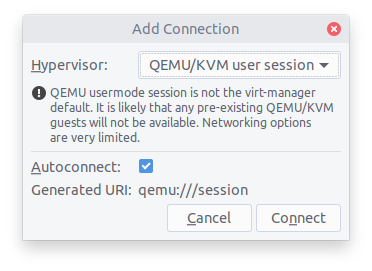
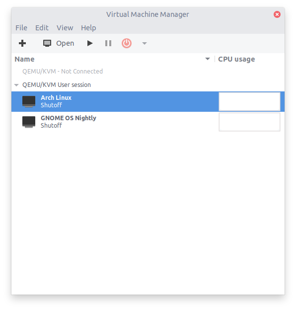
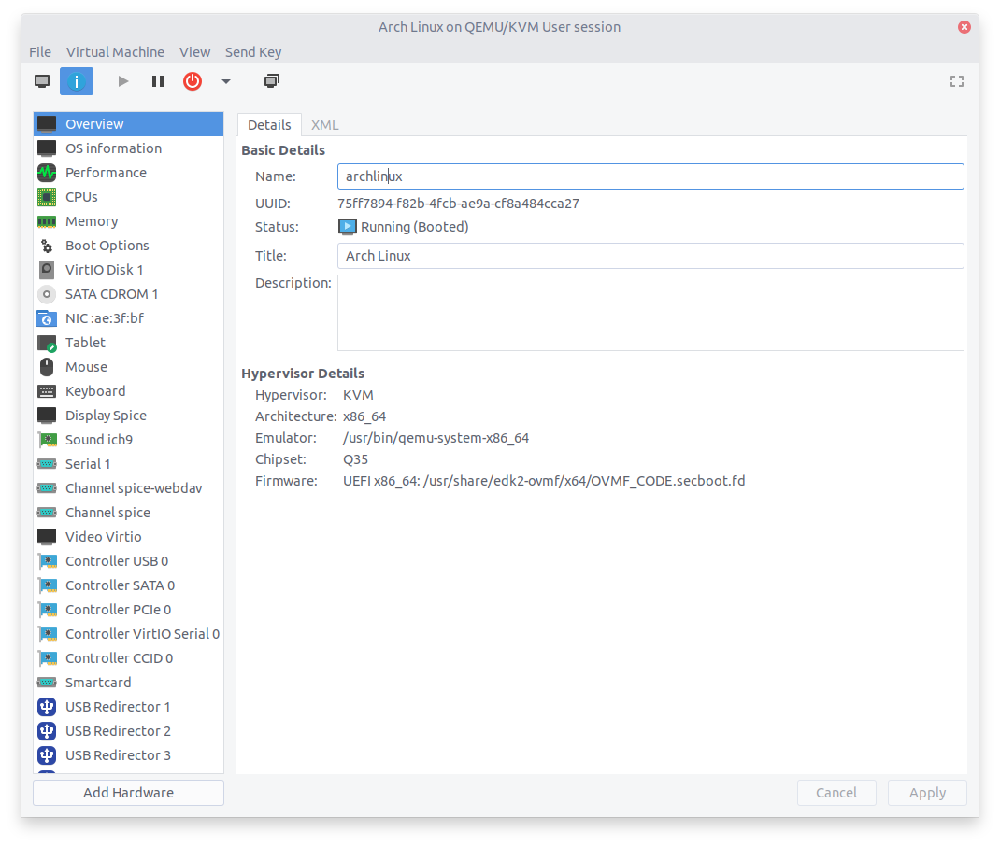

## GNOME Boxes: Installing Arch Linux as Guest

#### 1. Virtual Machine Settings

Create a virtual machine in GNOME Boxes with the default values: 2 GiB of RAM and 21.5 GB of maximum disk space.

#### 2. Enable UEFI Boot

Before installing Arch Linux in the virtual machine, configure the machine to boot with UEFI.

Ensure that the Virtual Machine Manager is installed:

```bash
sudo pacman -S virt-manager
```

> Note: configuration of the Virtual Machine Manager services is not required

To be able to configure virtual machine parameters, connect the Virtual Machine Manager, by selecting `File -> Add Connection...`. In the dialog box, select `QEMU/KVM user session` as the hypervisor, and click on the `Connect` button:



Virtual machines created in GNOME Boxes should now be available for editing in the Virtual Machine Manager. To enable XML editing, select `Edit -> Preferences` and check the `Enable XML editing` checkbox.

In the main window, double click on the Arch Linux virtual machine to configure it:



In the new window that appears, select `View -> Details`:



Switch to the XML tab in the machine properties, and locate the following XML snippet:

```xml
  <os>
    <type arch="x86_64" machine="pc-q35-6.2">hvm</type>
    <boot dev="hd"/>
    <bootmenu enable="yes"/>
  </os>
```

Change the first line to:

```xml
  <os firmware="efi">
```

Then click on the `Apply` button.

Restart the virtual machine in GNOME Boxes, it should now boot in UEFI mode. Proceed with arch Linux installation.

#### 3. Install Guest Tools

Install the guest tools in the guest system:

```bash
sudo pacman -S spice-vdagent spice-gtk
```

The `spice-vadagent` package improves graphics rendering of the virtual machine, while `spice-gtk` enables sharing folders between host and guest systems.

#### 4. Enable Shared Folders

Ensure that the virtual machine is running in GNOME Boxes. Open virtual machine properties, select the `Devices & Shares` tab, and add a shared folder in the `Folder Shares` section:


In the guest system, the shared folder can be found in Files in Other Locations, under `Spice client folder`.

> Note: when copying files from the host to the guest system, executable permissions for script files will be removed (and need to be manually re-added)
