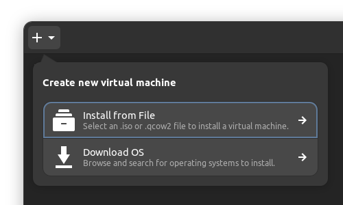
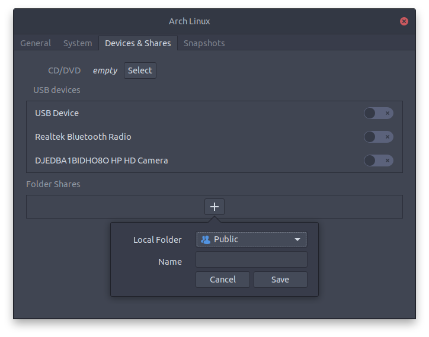

## GNOME Boxes: Installing Arch Linux as Guest

#### 1. Virtual Machine Settings

Create a virtual machine in GNOME Boxes with default values (2 GiB of memory and 21.5 GB of disk space), and enable UEFI boot:



Install Arch Linux.

#### 2. Install Guest Tools

After the Arch installation is complete, install the guest tools in the guest system:

```bash
sudo pacman -S spice-vdagent spice-gtk
```

The `spice-vadagent` package improves graphics rendering of the virtual machine, while `spice-gtk` enables sharing folders between host and guest systems.

Restart the guest system.

#### 4. Enable Shared Folders

Ensure that the virtual machine is running in GNOME Boxes. Open the virtual machine preferences, select the `Devices & Shares` tab, and add a shared folder in the `Folder Shares` section:



In the guest system, the shared folder can be found in Files in Other Locations, under `Spice client folder`.

> Note: when copying files from the host to the guest system, executable permissions for script files will be removed (and need to be manually re-added)
