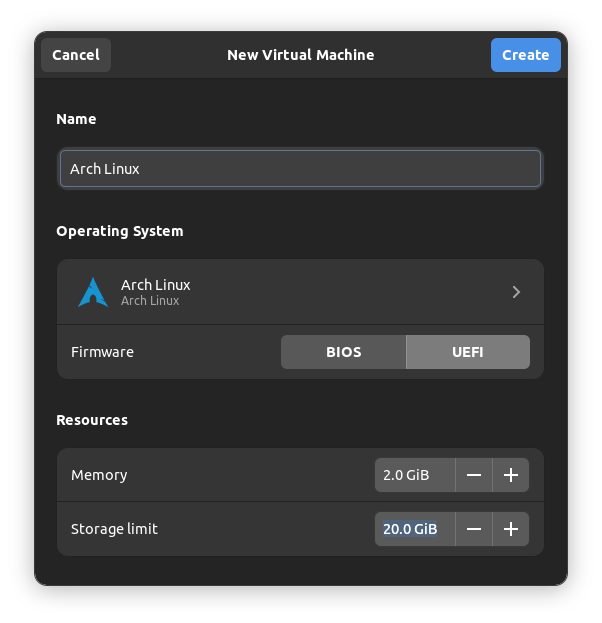

## GNOME Boxes: Installing Arch Linux as Guest

### 1. Virtual Machine Settings

Create a new virtual machine in GNOME Boxes:


Select 2 GiB of memory and 20 GiB of disk space. Ensure the UEFI firmware option is selected:



Install Arch Linux in the new virtual machine.

### 2. Install Guest Tools

After the Arch installation is complete, install the guest tools in the guest system:

```bash
sudo pacman -S spice-vdagent spice-gtk
```

The `spice-vadagent` package improves graphics rendering of the virtual machine, while `spice-gtk` enables sharing folders between host and guest systems.

Restart the guest system.

### 3. Enable Shared Folders

Ensure that the virtual machine is running in GNOME Boxes. Open the virtual machine preferences, select the `Devices & Shares` tab, and add a shared folder in the `Shared Folders` section:


In the guest system, the shared folder can be found in Files in Network, under `Spice client folder`.

> Note: when copying files from the host to the guest system, executable permissions for script files will be removed (and need to be manually re-added)
