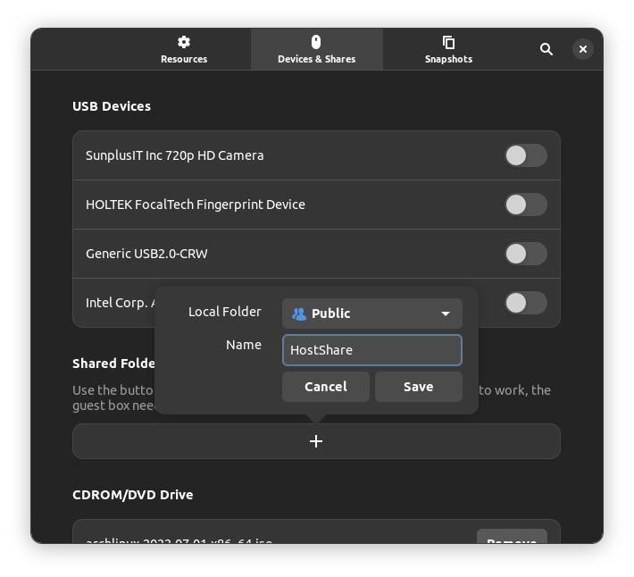

## GNOME Boxes: Installing Arch Linux as Guest

#### 1. Virtual Machine Settings

Create a virtual machine in GNOME Boxes with the default values: 2 GiB of RAM and 21.5 GB of maximum disk space.

#### 2. Enable UEFI Boot

Before installing Arch Linux in the virtual machine, configure the machine to boot with UEFI.

Open the virtual machine properties. In the `System` tab, click on the `Edit XML` button:


Locate the `<os>` XML section:

```xml
  <os>
    <type arch="x86_64" machine="pc-q35-6.2">hvm</type>
    <boot dev="hd"/>
    <bootmenu enable="yes"/>
  </os>
```

Change the first line to:

```xml
  <os firmware="efi">
```

Then click on the `Apply` button.

Restart the virtual machine in GNOME Boxes, it should now boot in UEFI mode. Proceed with arch Linux installation.

#### 3. Install Guest Tools

Install the guest tools in the guest system:

```bash
sudo pacman -S spice-vdagent spice-gtk
```

The `spice-vadagent` package improves graphics rendering of the virtual machine, while `spice-gtk` enables sharing folders between host and guest systems.

Restart the guest system.

#### 4. Enable Shared Folders

Ensure that the virtual machine is running in GNOME Boxes. Open virtual machine properties, select the `Devices & Shares` tab, and add a shared folder in the `Folder Shares` section:



In the guest system, the shared folder can be found in Files in Other Locations, under `Spice client folder`.

> Note: when copying files from the host to the guest system, executable permissions for script files will be removed (and need to be manually re-added)
